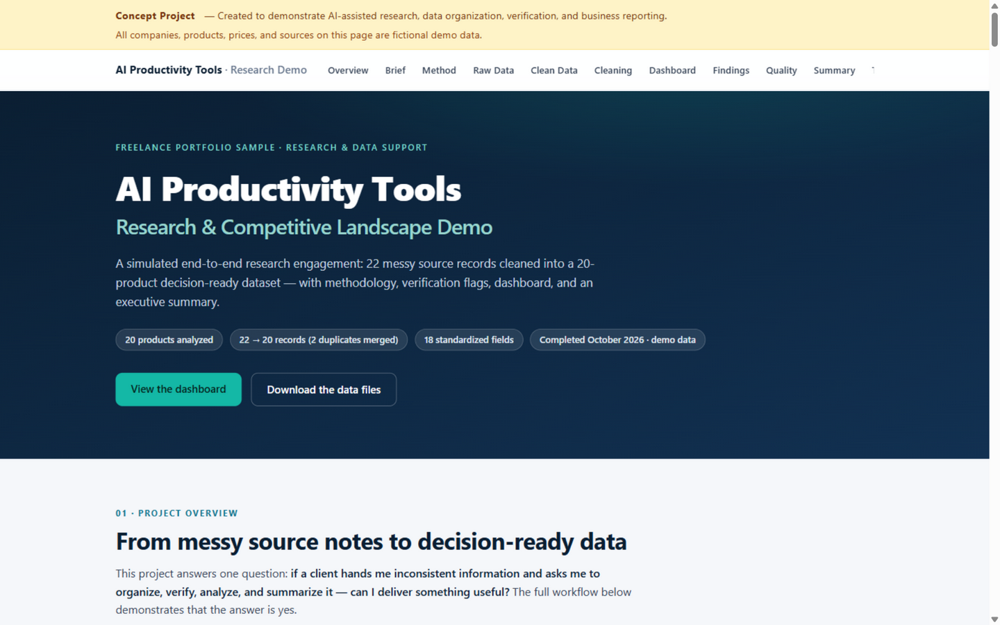
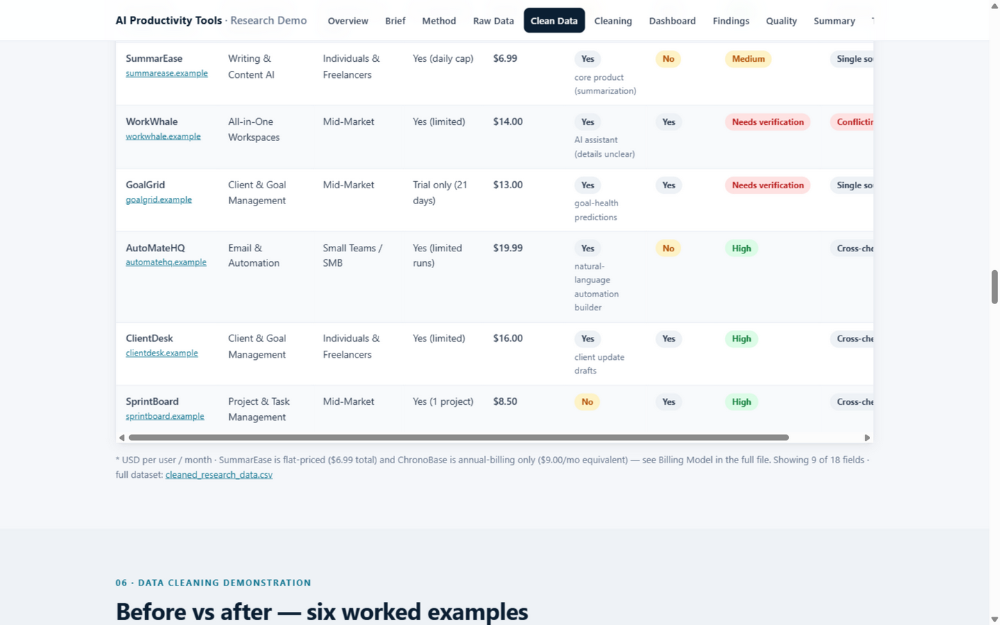
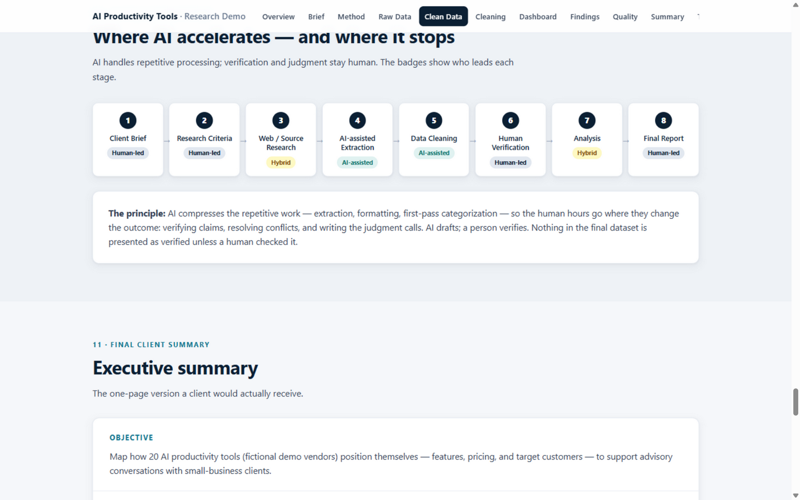

# AI Productivity Tools — Research & Data Organization Demo

A simulated end-to-end research engagement, presented as a single responsive portfolio page: 22 intentionally messy source records cleaned into a 20-product, 18-field decision-ready dataset on a fictional AI-productivity market — with methodology, before/after cleaning examples, a live browser dashboard, verification flags, and a one-page executive summary. All data files (CSV + a six-sheet XLSX workbook) are included.

## Project Type

Concept Project / Portfolio Project

## Overview

A fictional small-business consultancy ("Riverstone Advisory") asks for a structured comparison of 20 productivity software companies — how they position themselves, which features they emphasize, how they price, and which customer segments they target. The raw material arrives the way real research often does: mixed price formats, inconsistent capitalization and categories, missing fields, vague claims, and two duplicate listings.

The project answers one question a freelance client would ask: *if I hand you messy information and ask you to organize, verify, analyze, and summarize it — can you deliver something useful?* The repository is designed so the answer is visibly yes: every step from raw capture to cleaned dataset to dashboard to executive summary is documented and reproducible.

All companies, products, prices, websites, and sources are **fictional demo data** using the reserved `.example` domain suffix (RFC 2606). Nothing here represents real client work or claims about real companies.

## Features

- **Raw vs. clean data** — `data/raw_research_data.csv` (22 messy records) and `data/cleaned_research_data.csv` (20 products × 18 standardized fields), traceable record by record.
- **Six-sheet Excel workbook** — Read Me, Clean Data, Raw Data, Before & After, Summary Stats, and a QC Checklist, rebuildable via `scripts/generate_xlsx.py`.
- **Interactive presentation page** — client brief, 8-step methodology, raw/clean data tables, six worked before/after cleaning examples, a dashboard computed live in the browser from the embedded dataset, competitive findings, quality-control log, and an executive summary.
- **Verification workflow** — confidence levels (High / Medium / Needs verification), source-status labels (cross-checked / single source / conflicting), ISO 8601 dates, USD-per-user/month price normalization, and a duplicate-merge log.
- **AI + human split** — each workflow step shows where AI assists (extraction, normalization, summarization) and where human judgment is required (fact-checking, conflict resolution, final sign-off).
- **Documented headline findings** — pricing bands, target customers, AI-feature depth, free-plan availability, and market gaps, all computed from the demo dataset.

## Tools / Technologies

- HTML5, CSS3, vanilla JavaScript (presentation page; the dashboard computes from the clean dataset — no frameworks, no build step)
- CSV / Excel (deliverable datasets; the workbook is generated with Python + `openpyxl`)
- Python (`scripts/generate_xlsx.py` rebuilds `research_summary.xlsx` from the CSVs)
- ChatGPT / AI-assisted workflow (extraction support, normalization suggestions, summary drafting — with human verification, as documented on the page)

## What This Project Demonstrates

- Defining research criteria, field lists, and normalization rules before collecting data
- Cleaning messy source records: formatting, deduplication, flagging uncertainty, never guessing
- Traceability: every cleaned value traceable to a dated, typed source; every merge logged
- Turning a cleaned dataset into findings, a dashboard, and a one-page executive summary
- Honest AI-assisted habits: AI drafts and accelerates, a human verifies and decides
- Clear business communication: what a client would actually receive, and in what file

## Screenshots

## Live Demo

**https://heyjdy.github.io/ai-research-data-portfolio/**

## Repository Notes

- `data/` contains only fictional demo data — no personal or private information. Websites use the reserved `.example` TLD and cannot resolve to real sites.
- To regenerate the workbook after editing the CSVs: `pip install openpyxl` then `python scripts/generate_xlsx.py`.

## Disclaimer

This is a concept portfolio project created to demonstrate design, development, research, and/or AI-assisted workflow capabilities. It was not produced for a real client, and no client results or performance claims are implied.
